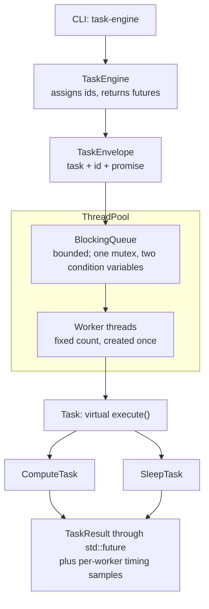

# Concurrent Task Engine

A focused C++17 systems project: a bounded producer-consumer queue feeding a
configurable pool of worker threads that execute polymorphic tasks. Every task
comes back as a `std::future<TaskResult>` that is fulfilled exactly once, whether
the task succeeds, throws, or is refused. The engine supports graceful (drain)
and abort shutdown, records per-task timing, and ships with a command-line
driver, a sanitizer-backed test suite of 133 tests, a repeatable benchmark
harness, and a multi-stage Docker build.

## Why this project

The engine is small on purpose. It exists to work through the problems that make
concurrent C++ hard to get right, and to leave evidence for each answer:

- **Ownership and lifetime** — who owns a task at every step from submission to
  completion, and what guarantees that the queue outlives the threads using it.
- **Concurrency** — a fixed set of workers, no thread per task, and results that
  reach the caller no matter which path the task takes.
- **Synchronization** — blocking waits without polling, and shutdown that
  releases every blocked producer and consumer.
- **Graceful shutdown** — finishing queued work, or abandoning it, without
  interrupting running tasks or leaving a caller waiting forever.
- **Performance measurement** — a benchmark with a fixed methodology, where the
  numbers that did not match the design's predictions are reported alongside
  the ones that did.

## Features

- **Bounded `BlockingQueue<T>`** with blocking push (backpressure), `pop()`
  returning `std::optional<T>`, and a `close()` that releases every blocked
  thread without discarding queued items.
- **`ThreadPool`** with a configurable number of workers, created once and joined
  on shutdown.
- **Two shutdown modes**: `shutdown()` drains everything already queued;
  `shutdown_now()` abandons queued work and reports each abandoned task as
  rejected. The destructor drains and joins.
- **`TaskEngine`** facade: `submit(std::unique_ptr<Task>)` returns
  `std::future<TaskResult>`, with monotonically increasing task ids and a
  summary of the run.
- **Polymorphic tasks**: `ComputeTask` (deterministic CPU work) and `SleepTask`
  (occupies a worker without using a core).
- **Result propagation**: every result is `Succeeded`, `Failed` (with the
  exception's message) or `Rejected`. A task that throws never takes down a
  worker.
- **Per-task timing** of queue wait, execution and total latency, with p50/p95 by
  nearest rank.
- **CLI** (`task-engine`) with input validation, documented exit codes, fault
  injection, and graceful handling of SIGINT and SIGTERM.
- **Benchmark harness** (`bench-task-engine`) with warm-up, repetitions and
  environment capture.
- **Sanitizer builds** (ASan + LSan + UBSan, TSan) selectable through one CMake
  option.
- **Multi-stage Dockerfile** that runs the tests during the image build.

## Architecture



**Ownership.** The caller hands over a `std::unique_ptr<Task>`. `TaskEngine` wraps
it in a move-only `TaskEnvelope` together with its id, submission time and a
`std::promise<TaskResult>`, and hands the matching `std::future` back to the
caller. The envelope moves through the queue to exactly one worker, which runs
the task and fulfils the promise. There are no raw owning pointers and no
`shared_ptr` anywhere.

`TaskEngine` owns the `ThreadPool`, and the pool owns the queue, the per-worker
timing buffers and the worker threads. The declaration order of those members is
load-bearing: the threads are destroyed first, so the queue they use always
outlives them.

**Shutdown.** Shutdown always closes the queue before joining the workers. Drain
mode lets the workers finish everything already queued. Abort mode removes the
queued envelopes in the same locked step as the close, and fulfils each one as
`Rejected`. Neither mode interrupts a task that is already running. In every
case — success, a thrown exception, submission after shutdown, abandoned work,
or the engine being destroyed — each future resolves exactly once.

The full design is in [`docs/ARCHITECTURE.md`](docs/ARCHITECTURE.md).

## Key C++ concepts demonstrated

- **RAII** — the pool's destructor drains and joins, locks are scoped with
  `std::lock_guard` and `std::unique_lock`, and member declaration order
  guarantees the queue outlives the workers.
- **Rule of zero and explicit ownership** — `TaskEnvelope` and `TaskResult`
  declare no copy or move operations of their own; they are move-only or
  copyable because their members are. `TaskResult` is built only through named
  factories, so invalid combinations cannot be constructed.
- **`std::unique_ptr`** — task ownership transfers from caller to engine to queue
  to worker with no copies and no shared ownership.
- **Move semantics** — `BlockingQueue::push` takes `T&&`, so an element cannot be
  copied by accident, and `pop()` emplaces into `std::optional` so elements need
  no default constructor. Tests confirm elements are moved, never copied.
- **Virtual dispatch** — `Task::execute()` is the one virtual call. The base class
  has a virtual destructor defined out of line, and protected copy and move
  operations so objects cannot be sliced through a base-class reference.
- **`std::mutex` and `std::condition_variable`** — one mutex guards the queue;
  producers and consumers wait on separate condition variables using predicate
  waits, and notifications are sent after the lock is released.
- **Futures and promises** — each envelope's promise is fulfilled exactly once,
  and a refused submission is fulfilled as `Rejected` rather than left as a
  broken promise.
- **Atomics where they are justified** — the task-id counter, the rejection
  counter, and the signal flag, a `std::atomic<bool>` whose lock-free property is
  checked at compile time because it is written from a signal handler.
- **Exceptions across a worker boundary** — the code that runs a task is
  `noexcept` and catches `std::exception` and `...`, so a throwing task becomes a
  `Failed` result instead of an escaped exception calling `std::terminate`.
- **C++17** — `std::optional`, `std::string_view`, `std::from_chars`,
  `[[nodiscard]]` and `inline constexpr`, compiled as strict `-std=c++17` with
  GNU extensions off.
- **CMake** — target-scoped warnings with `-Werror`, a sanitizer build option,
  GoogleTest pinned to a commit through `FetchContent`, and CTest labels for each
  test suite.

## Build

Linux is required. The project was developed and tested on Ubuntu 24.04 under
WSL2 with GCC 13.3.0 and CMake 3.28.3; CMake 3.22 is the minimum.

```bash
sudo apt install build-essential cmake git
```

Release:

```bash
cmake -S . -B build/release -DCMAKE_BUILD_TYPE=Release
cmake --build build/release -j"$(nproc)"
```

Debug:

```bash
cmake -S . -B build/debug -DCMAKE_BUILD_TYPE=Debug
cmake --build build/debug -j"$(nproc)"
```

The build produces `task-engine`, `benchmarks/bench-task-engine` and the test
binaries. Release is pinned to `-O2 -DNDEBUG`. GoogleTest is downloaded at
configure time, so the first configure needs network access; add
`-DTASKENGINE_BUILD_TESTS=OFF` to build without the tests.

## Run

A successful run:

```console
$ ./build/release/task-engine --workers 4 --tasks 10000 --work 500
task-engine 0.1.0

configuration
  workers          4
  tasks            10000
  work             500
  queue capacity   1024
  fail every       0

running...

outcome
  submitted        10000
  succeeded        10000
  failed           0
  rejected         0

  durations              min         p50         p95         max        mean
  queue wait        282.00ns      6.54us    258.71us    488.75us     35.36us
  execution         380.00ns    467.00ns    717.00ns     24.90us    506.00ns
  latency           736.00ns      7.03us    259.13us    490.77us     35.87us

wall time          140.89ms
throughput         70976 tasks/s

Single run, no warm-up: these are what this invocation did, not a
benchmark. Use bench-task-engine for repeatable measurement.
```

Failure injection — every 10th task throws, and the run exits with code 1:

```console
$ ./build/release/task-engine --workers 4 --tasks 100 --work 100 --fail-every 10
...
outcome
  submitted        100
  succeeded        90
  failed           10
  rejected         0
...
$ echo $?
1
```

Help and version:

```console
$ ./build/release/task-engine --help
task-engine - concurrent task processing engine

Usage:
  task-engine [options]

Options:
  --workers N          worker threads (default: hardware concurrency)
  --tasks N            tasks to submit (default: 1000)
  --work N             compute iterations per task (default: 1000)
                       0 submits empty tasks, measuring engine overhead
  --queue-capacity N   bounded queue capacity (default: 1024)
  --fail-every N       make every Nth task throw (default: 0, never)
                       fault injection, for exercising the failure path
  -h, --help           print this help and exit
      --version        print the version and exit

Exit codes:
  0  every task succeeded
  1  the run completed, but at least one task failed or was rejected
  2  invalid usage or configuration

Examples:
  task-engine --workers 8 --tasks 10000 --work 500
  task-engine --workers 1 --tasks 100 --work 0
  task-engine --tasks 100 --fail-every 10

$ ./build/release/task-engine --version
task-engine 0.1.0
```

Option values are separated by a space (`--workers 8`). Results go to stdout and
diagnostics to stderr. SIGINT or SIGTERM stops a run gracefully: submission
stops, queued work is abandoned and counted as rejected, running tasks finish,
the report states that the run was interrupted, and the exit code is 1.

## Testing

**133 tests** in four CTest suites: 80 unit, 33 concurrency, 8 stress and 12
integration. Every `TEST()` is registered individually, so a failure names the
exact case.

```bash
ctest --test-dir build/debug --output-on-failure
ctest --test-dir build/release --output-on-failure

ctest --test-dir build/debug -L unit          # no threads
ctest --test-dir build/debug -L concurrency  # queue, pool and engine under concurrent use
ctest --test-dir build/debug -L stress       # high volume, abort under load, repeated create/destroy
ctest --test-dir build/debug -L integration  # the real binaries: exit codes, stdout/stderr, signals
```

The concurrency and stress suites check the engine's invariants directly: every
item delivered exactly once, every future resolved with no broken promise,
blocked threads released on shutdown, and no worker threads left behind. The
integration suite runs `task-engine` in a child process and sends it SIGINT and
SIGTERM. No test coordinates threads with a sleep; the two bounded waits that
remain are explained in the code and in
[`docs/DECISIONS.md`](docs/DECISIONS.md) (D33).

**AddressSanitizer + LeakSanitizer + UndefinedBehaviorSanitizer:**

```bash
cmake -S . -B build/asan -DCMAKE_BUILD_TYPE=Debug -DTASKENGINE_SANITIZER=address+undefined
cmake --build build/asan -j"$(nproc)"
ctest --test-dir build/asan --output-on-failure
```

**ThreadSanitizer:**

```bash
cmake -S . -B build/tsan -DCMAKE_BUILD_TYPE=Debug -DTASKENGINE_SANITIZER=thread
setarch "$(uname -m)" -R cmake --build build/tsan -j"$(nproc)"
TSAN_OPTIONS=halt_on_error=1 setarch "$(uname -m)" -R \
    ctest --test-dir build/tsan --output-on-failure

# repeat to exercise more interleavings
TSAN_OPTIONS=halt_on_error=1 setarch "$(uname -m)" -R \
    ctest --test-dir build/tsan -L concurrency --repeat until-fail:25
```

`setarch -R` disables address-space randomisation for that process tree. Current
kernels, WSL2 included, use more ASLR entropy than TSan's fixed shadow-memory
layout allows, and TSan aborts at startup without it.

All 133 tests pass in Debug and Release from a clean clone with zero compiler
warnings. The test suite, repeated runs of the concurrency, stress and
integration suites, and the benchmark harness have all run clean under both
sanitizer builds. Before its results were trusted, ThreadSanitizer was checked
against a deliberately planted data race built with the same flags, so a clean
TSan run is evidence rather than silence.

## Benchmarking

```bash
./build/release/benchmarks/bench-task-engine > results.csv
```

The harness is a fixed experiment, so every run measures the same thing:

- **Workload profiles**: `cpu-heavy` (4,000 tasks of 200,000 iterations),
  `lightweight` (200,000 tasks of 200 iterations), `blocking` (400 tasks that
  each sleep 2 ms), plus an `overhead-floor` of empty tasks on one worker.
- **Worker counts**: 1, 2, 4, 8, 12 and 16.
- **Protocol**: one discarded warm-up run, then 5 measured repetitions per
  configuration, reporting the median, minimum and maximum.
- **Setup excluded**: tasks are constructed and worker threads started before the
  clock starts. The timed region runs from the first submission until drain
  shutdown returns, with submission time recorded separately.
- **Environment captured** in the CSV: CPU model, logical CPU count, kernel, OS,
  compiler, build type, flags, sanitizer mode and timestamp.
- **Measurement builds only**: the harness refuses to measure Debug or sanitizer
  builds. A `--smoke` mode runs a tiny matrix in any build to check that the
  harness works, and is part of the integration suite.

### Results

Throughput in tasks per second, median of 5 repetitions:

| Workers | CPU-heavy | Lightweight | Blocking |
|---:|---:|---:|---:|
| 1 | 6,549 | 1,042,422 | 451 |
| 4 | 21,617 | 66,772 | 1,812 |
| 8 | 30,475 | 77,373 | 3,703 |
| 16 | 33,432 | 89,753 | 7,358 |

> These are measurements from one laptop — a 12th Gen Intel Core i5-12450H with
> 12 logical CPUs, running Ubuntu 24.04.4 under WSL2 — with GCC 13.3.0 in Release
> at `-O2`, one submitting thread and a queue capacity of 1024. WSL2 is a virtual
> machine, so the numbers compare worker counts on that machine; they are not
> bare-metal figures or performance guarantees.

A second full run agreed within 4% for most configurations. The largest
difference was 12.7%, at 16 workers on the CPU-heavy profile, and the two runs
disagreed on whether 12 or 16 workers was faster there, so no ordering between
them is claimed. Both runs, with every latency column and the 2- and 12-worker
rows, are in [`benchmarks/results/`](benchmarks/results/).

**What the numbers show:**

- **CPU-heavy scaling saturates.** Throughput reached 3.30× at 4 workers but only
  4.65× at 8 and 5.11× at 16. Each task does identical, deterministic work, yet
  its measured execution time roughly doubled — from about 142 µs to about
  300 µs — once 8 or more workers were running. That is consistent with threads
  landing on Hyper-Threading siblings and on this hybrid CPU's efficiency cores;
  threads are not pinned, so the benchmark does not separate those effects.
- **Blocking work scales with workers, not cores.** A sleeping worker does not use
  a CPU, so 16 workers delivered 16.3× the single-worker throughput on 12 logical
  CPUs.
- **Lightweight work exposes synchronization overhead.** Going from 1 to 4 workers
  made throughput about 15× *slower*. Voluntary context switches rose from 0.08
  to 1.21 per task over the same change: several workers empty the queue faster
  than one thread can fill it, so nearly every push has to wake a blocked worker.
  The engine's single mutex and per-push notification cost nothing measurable
  for 142 µs tasks, and dominate for 0.2 µs ones.

The detailed analysis, including the overhead floor of about 0.8 µs per task and
where the design's predictions were wrong, is in
[`docs/DECISIONS.md`](docs/DECISIONS.md) (D34).

## Docker

```bash
docker build -t task-engine .
docker run --rm task-engine --workers 4 --tasks 10000 --work 500
docker run --rm task-engine --version
docker run --rm task-engine            # no arguments: prints --help
```

- **Multi-stage build.** The build stage installs the toolchain and compiles a
  Release build; the runtime stage copies in only the binary.
- **Pinned base.** Both stages use `ubuntu:24.04` pinned by digest, so the binary
  runs on the same glibc and libstdc++ it was built against.
- **Tests during the build.** The unit, concurrency and integration suites (125
  tests) run inside the build stage, so an image is only produced if they pass.
  Stress tests are left to the host sanitizer runs.
- **Non-root runtime.** The container runs as a dedicated system user
  (`uid=999`), with no compiler, CMake, make or git in the image.
- **Signals.** `docker stop` sends SIGTERM, which the CLI handles gracefully:
  it prints its report and exits with code 1.
- **Reproducibility.** The base image is pinned; the apt packages installed on top
  are not, so builds are reproducible in toolchain version rather than bit for
  bit.

The container reproduces the build and runs the CLI. Benchmark numbers are never
taken inside it.

## Project structure

```
include/taskengine/
  core/          Task, TaskResult, TaskEnvelope, task state and ids
  concurrency/   BlockingQueue, ThreadPool
  execution/     TaskEngine
  metrics/       run summary and nearest-rank percentiles
  tasks/         ComputeTask, SleepTask
  cli/           argument parsing, validation, exit codes
src/             library implementation; src/app/main.cpp is the CLI
tests/
  unit/  concurrency/  stress/  integration/  support/
benchmarks/      bench-task-engine and the committed result CSVs
docs/            ARCHITECTURE.md, DECISIONS.md
Dockerfile       multi-stage container build
```

## Design decisions

Every non-obvious choice is recorded with its reason, the alternative that was
considered and the trade-off — 34 decisions in
[`docs/DECISIONS.md`](docs/DECISIONS.md). The most important ones:

- **Bounded queue with blocking push.** Backpressure instead of unbounded memory
  growth; it also makes queue-wait measurements meaningful. (D5)
- **Futures, with refusals delivered as results.** A refused or abandoned task
  resolves as `Rejected` instead of leaving the caller with a broken promise.
  (D3, D25)
- **Task failures are results, not exceptions.** A throwing task produces a
  `Failed` result with its message, so failures can be counted. (D4)
- **Two explicit shutdown modes**, and member declaration order treated as a
  correctness requirement. (D6, D26)
- **A polymorphic `Task` kept only on evidence** — the two task types differ in
  kind, not just by a parameter. (D1, D28)
- **Per-worker timing buffers**, so recording measurements adds no contention
  between workers. (D10)
- **Strict C++17 enforced by the build**, with a CMake minimum chosen for a
  documented correctness reason. (D17)
- **A deliberately narrow scope**, ending at a CLI, tests, benchmarks and a
  container. (D30)

## Limitations

These are deliberate scope decisions, documented rather than hidden:

- **Single process, single machine.** There is no distributed execution or
  distributed scheduling.
- **No per-task cancellation.** Running tasks are never interrupted: shutdown
  waits for them. A signal is noticed between submissions, so a submitter blocked
  on a full queue sees it once a worker frees a slot.
- **No service integrations.** There is no HTTP API, FastAPI service, RabbitMQ or
  other message broker, database or cloud deployment; these were removed from
  scope rather than deferred.
- **No re-entrant use from inside a task.** A task must not submit work to, or
  shut down, the engine running it: submitting can deadlock against a full queue
  that only that worker could drain, and shutting down would make a worker wait
  for itself.
- **Benchmark numbers are environment-specific.** They come from one WSL2 laptop
  with a hybrid CPU and unpinned threads, and compare worker counts on that
  machine only.
- **Memory grows with run size.** Exact percentiles keep every sample, about 40
  bytes per completed task, which puts one run on an 8 GB machine at roughly 10^8
  tasks.
- **One submitting thread** in the CLI and the benchmark, so very small tasks are
  limited by hand-off and wake-up cost rather than by the workers.
- **Linux only.** The tests rely on `/proc`, POSIX signals and process APIs.
- **The CLI accepts space-separated option values only**; `--workers=8` is
  rejected.

## What I learned / engineering focus

- **Making invariants testable.** "Every future is fulfilled exactly once" is
  checked on every shutdown path, under load, and after the engine is destroyed.
- **Treating sanitizers as evidence.** Tests create interleavings and
  ThreadSanitizer judges them, and the sanitizer was itself checked against a
  known race.
- **Removing timing from tests.** Several tests that only passed because of
  scheduling were rewritten to be deterministic, including one that raced the
  kernel's removal of exited threads from `/proc`.
- **Measuring before explaining.** When lightweight tasks slowed down, the cause
  was established from context-switch counts rather than assumed, and the design
  prediction that turned out wrong was kept next to the measurement.
- **Keeping scope small.** Each component had to justify its existence, and each
  trade-off is written down.

## License

No license has been specified yet.

## Author

**Adhiraj Dubey**
GitHub: [https://github.com/Adhiraj170204](https://github.com/Adhiraj170204)
